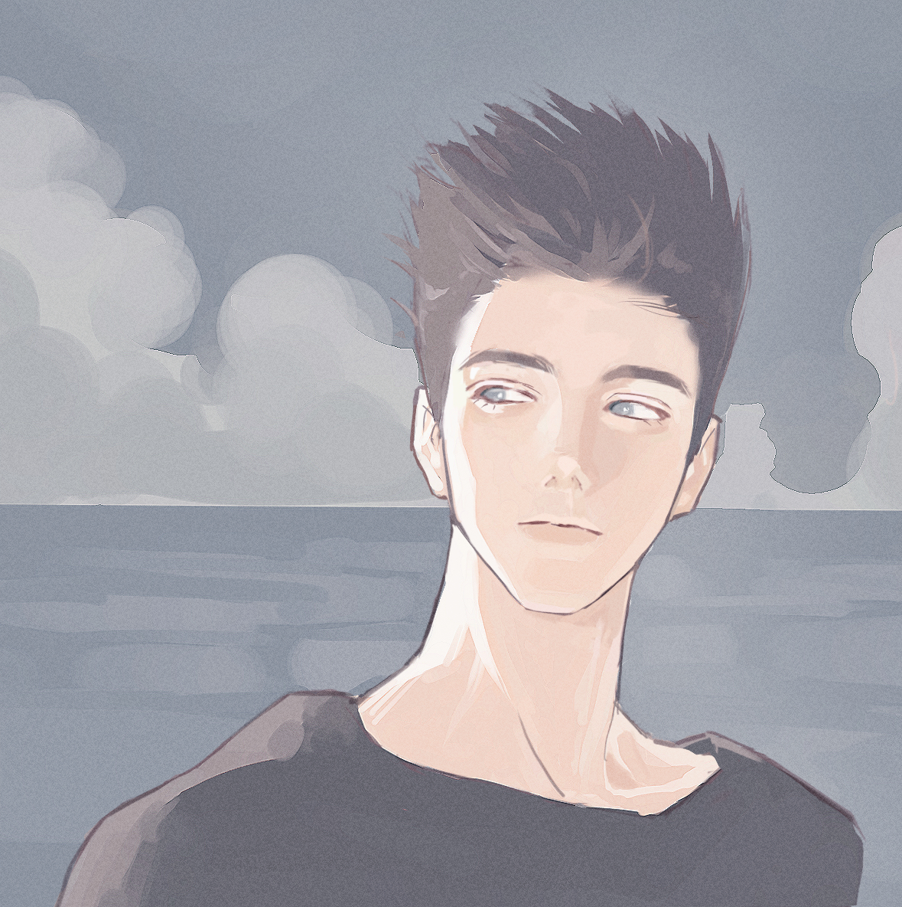

+++
title = "三月花季，以及重启的画画练习"
date = "2024-03-11"
description = "略微卡手的体验"
tags = [
    "画画笔记",
]
categories = [
    "学画画",
]
image = "IMG_5302.JPG"
+++
月初和家里人去公园看樱花，国内种的品种颜色很红艳，不是我喜欢的类型。最后拍了一些海棠，用作笔记的主题图啦。

春节期间很疲劳，几乎没画画。也在考虑近半年手感不佳的问题，总之还是没练和没思考的问题，所以报了一期1h练习，下旬开始。希望能练到快速构图的能力和大效果的搭建。

设计方面，想要修制一套像样的角色。算是近期最主要的正事，之后单独开一个tag记录吧。

记几个上旬的练习过程和总结

# 笔刷尝试-同人

经常刷到厉害的圆头笔作图，之前也被强烈安利19号，所以想自己试一下圆头笔上色。在csp国内的库下到了仿19号，但画着画着又用回了[zu上色刷](https://www.udongman.cn/resource/details/material/5733#desc)。这支原始的参数是出墨很淡的，方便叠颜色。

#### 起草
因为只是试笔刷，所以徒手起草了。

形不准，事实证明这样并不会加快总体速度，反而在之后花费了更多时间来调整。

#### 色稿
* 色调：想要一个低饱和的淡淡的效果。
* 结构：战术性加宽了肩膀。想要柔和一点所以把发际线的棱角磨平了。


问题：对面部体块不熟，素描关系一坨。



解决办法：
~~假装是水彩风格，这一切都只是随机水纹。~~
1. 找面块归纳的模型作参考。
2. 找一些我喜欢的厚涂画手，观察她们画面部大致分了多少个调子。



结果：调子3-4个即可。单光源的话，二分+反光已经概括了大部分结构。
 思路和赛璐璐一样的啊！区别只在后期处理材质和细化，前期别画蛇添足了。


#### 细化
* 色调
 * 根据以上修正方法，重画肤色调。
 * 人物饱和度下调。
* 结构：疯狂地修正了千疮百孔的结构，祛除了发腮特效。
 *此处耗时非常长，本来是起稿阶段该做的事。*

#### 进一步细化
* 修正五官结构。（眼眶分细一些显得眼窝深）
* 色温再往冷了调，阴影加了点冷色。
* 加入下睫毛，史诗级加强。
* 锐化+柏林噪声经典套餐收尾

#### 过程记录

       

#### 总结+待解决问题


1. 没练素描的问题请多关注吧，到最后画面都不是很利索的样子。
2. 起稿认真一些节约很多时间。
3. 肩颈为何这样？


以后一天一线稿头吧，再不会画也该会画了。

然后在正式打卡前尽量跟练1h，一周能攒出合集吗？