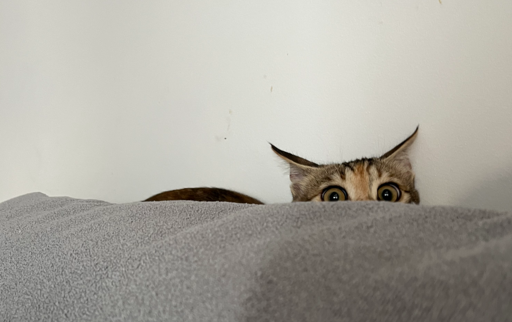

## 理由？

对中心化过敏，在朋友安利下想试着建设赛博笔记本。大概会记录一些日常，学画画笔记等。

## 过程

零基础对码和基本原理一无所知，全程参考塔塔老师的[搭建个人博客教程](https://mantyke.icu/posts/2021/hugo-build-blog/)。十分感谢！等装修得有个样子了再去给老师repo

第一遍使用了文章里推荐的memE主题，一切顺利。之后想要更换成stack，在换themes的过程中逐渐迷失了。最后重新搭建了几次，直接fork了魔改版仓库，目前为止顺利。

现在不敢进行大的改动，实在对炸了重装感到疲惫了！（友：熟练就好了）打算一点点修改基础的设置。偶尔会出现push的时候提示无法连接到github，但重复几次又能push上去了……所以没有考虑修改什么，就当是网不好吧。

接下来就是缓慢调整下页面分类、学着插入一下画廊等花活。走一步看一步吧

感谢朋友[Kawa1Planet](https://kawa1planet.fun/)一晚上的电话教学，不然可能第一遍重装就失去耐心了hh

## To-do list

> □修改右边一栏
> □设置博客icon
> □修改评论区，更喜欢waline的

## 看看猫

 

相册语法来自 [Typlog](https://typlog.com/)